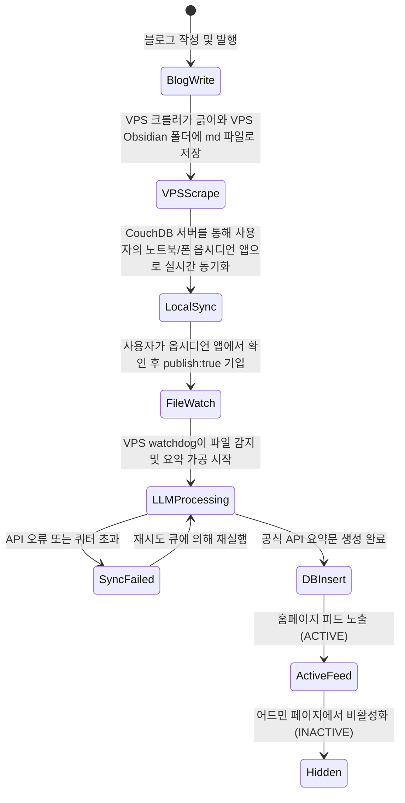
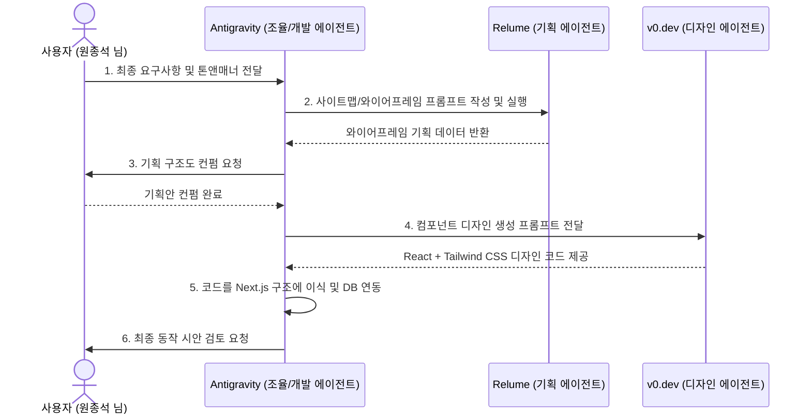

# 개인 활동 허브 (Personal Brand Hub) 구축 프로젝트 - 2단계: 기능 명세서 (Feature Specification)

## 1. 프론트엔드 (공개 사이트) 기능 명세

### F-01: 메인 레이아웃 및 GNB (Global Navigation Bar)
- **GNB 레이아웃**: 좌측 상단 `Jongseok Won` 텍스트 로고. 우측 상단 `About`, `Work`, `Projects`, `Contact` 메뉴 배치.
- **반응형 동작**: 모바일 해상도(768px 이하) 대응을 위한 햄버거 메뉴 및 모바일 드로워 UI 탑재.
- **소셜 바로가기 아이콘**: GitHub, LinkedIn, Naver Blog의 공식 링크로 새 창(`target="_blank" rel="noopener noreferrer"`) 이동이 가능한 아이콘 버튼을 헤더 우측 및 푸터에 항상 고정 노출.

### F-02: Hero 영역 및 프로필 카드
- **프로필 메인 카피**: 
  - 메인 Headline: `개발자로 시작해 회사를 운영했고, 지금은 다시 직접 만들고 있습니다.` (Pretendard Bold, 32px~40px)
  - 서브 카피: `Founder, CEO, CFO로 회사를 만들고 운영해온 경험을 바탕으로 소프트웨어, 업무 자동화, 비즈니스 인텔리전스, AI 활용 워크플로를 직접 실험하고 기록합니다.` (Muted Text, 16px)
- **프로필 카드(우측)**: 
  - 사진 또는 미니멀 프로필 일러스트 삽입.
  - 현재 관심 분야 리스트(`Current focus`: Software, Business Intelligence, Workflow Automation) 노출.
  - 이메일 문의하기(`Contact Me`) 버튼 배치.

### F-03: 동적 활동 피드 그리드 (Activity Feed Grid)
- **필터링 시스템**:
  - `All`, `Software`, `Business`, `Workflow & Automation` 카테고리 탭.
  - 탭 클릭 시 클라이언트 측에서 즉시 필터링(Flicker 없는 부드러운 트랜지션 애니메이션 적용).
- **카드 UI 레이아웃**:
  - **출처 표기**: 네이버 블로그, GitHub, Notion 등의 출처 서비스 이름과 아이콘 표기.
  - **콘텐츠 요약**: LLM이 가공해 준 2~3줄 요약본(최대 150자 제한) 노출.
  - **태그**: 해당 카드 하단에 연관 태그 뱃지 노출.
  - **게시일**: `YYYY-MM-DD` 형식으로 포스팅 원본 등록일 표시.
  - **카드 전체 클릭**: 클릭 시 포스팅의 원본 URL로 이동 (`originalUrl`).
- **페이지네이션 (Pagination)**:
  - 초기 로드 시 9개 카드 노출. 하단에 `더 보기 (Load More)` 버튼 배치하여 무한 스크롤 또는 Ajax 추가 로드 방식으로 구현.

---

## 2. 백오피스 & 동기화 서버 기능 명세

### B-01: 어드민 제어 화면 (Admin Dashboard)
- **경로**: `/admin` (쿠키 기반 세션 로그인 처리).
- **포스트 목록 조회**:
  - 전체 수집된 포스팅을 페이징 목록으로 테이블 출력.
  - **노출 제어**: 스위치(Toggle) UI를 사용해 즉각적으로 `ACTIVE` <-> `INACTIVE` 변경 가능.
  - **수정 기능**: 제목, 요약 텍스트, 태그를 편집할 수 있는 인라인 편집 또는 모달 창 제공.
- **에이전트 모니터링 로그**:
  - 에이전트 연동 성공/실패 내역(`SyncLog` 테이블)을 로그 목록으로 출력.
  - 실패 시 에러 사유 및 스택 트레이스 세부 보기 기능 제공.

### B-02: LLM API 설정 및 에이전트 제어판
- **API Key 관리**: OpenAI/Anthropic API Key를 입력받아 `.env` 혹은 암호화 파일에 안전하게 세팅하고 갱신하는 기능.
- **수동 동기화 실행**: 에이전트를 백그라운드 크론 대기 시간과 관계없이 즉시 수동 기동시키는 실행 버튼 탑재.

### B-03: 옵시디언 동기화 서버 (Self-hosted Sync Server)
- **역할**: 사용자의 로컬 스마트폰, 노트북 등 외부 기기와 VPS 상의 옵시디언 Vault 디렉토리를 실시간으로 자동 양방향 동기화 처리.
- **구현 방식**: 
  - VPS 내부에 CouchDB를 활용한 **Obsidian Self-hosted LiveSync** 프로토콜 서버를 Docker 컨테이너로 백그라운드 상시 가동.
  - 외부 기기의 옵시디언 앱에서 해당 VPS 동기화 주소 및 계정을 입력하여 연동.

---

## 3. VPS 백그라운드 에이전트 기능 명세

### A-01: 콘텐츠 동기화 모듈 (Obsidian Watcher & Scraper)
- **작동 시나리오**:
  1. **네이버 블로그 수집**: VPS에서 파이썬 크롤러가 네이버 블로그 새 글을 주기적으로 긁어 VPS 내 옵시디언 폴더인 `/home/ubuntu/obsidian_vault/naver_blog`에 `.md` 마크다운 파일로 직접 저장.
  2. **디렉토리 감시**: 파이썬 `watchdog` 스크립트가 `/home/ubuntu/obsidian_vault` 하위 디렉토리의 파일 변경(수정/생성) 이벤트를 실시간 감시.
  - 마크다운 파일의 YAML Frontmatter를 읽어 `publish: true` 및 원본 메타데이터(URL, 날짜, 제목) 추출.

### A-02: LLM 요약 가공 모듈 (공식 API 호출)
- **API 호출**:
  - `openai` 또는 `anthropic` 공식 SDK 라이브러리를 사용해 API 엔드포인트 호출.
  - 보안 토큰과 프롬프트를 헤더에 담아 안전하게 비동기 요청 전송.
- **요약 프롬프트 템플릿**:
  - 역할: `당신은 비즈니스와 소프트웨어 개발에 정통한 수석 큐레이터입니다.`
  - 태스크: `전달받은 글의 본문을 2~3문장(한글 150자 이내)으로 핵심 요약하고 카테고리 [Software, Business, Workflow] 중 가장 연관된 태그를 1~3개 선정하십시오.`

### A-03: 데이터베이스 퍼블리셔
- 요약이 완료되면 로컬 SQLite 데이터베이스에 가공 완료된 포스팅 레코드를 직접 Insert하거나 VPS 내부 API를 통해 안전하게 적재.
- 동기화 완료된 마크다운 데이터는 VPS 상에서 `synced` 플래그를 두거나 캐시 DB에 이력을 기록하여 중복 가공 방지.

---

## 4. 데이터 스키마 및 상태 전이도

### 4.1 포스트 상태 전이도 (VPS 기준)

---

## 5. 디자인 멀티에이전트 협업 워크플로우 명세

프론트엔드 UI/UX 작업 시, 기획부터 컴포넌트 디자인, 코드 마감까지 각 단계를 담당하는 AI 에이전트 간의 협업 구조는 다음과 같습니다. 

### 5.1 에이전트 역할 및 책임 (R&R)
1. **기획 및 정보 구조 설계 에이전트 (Relume)**:
   - 사용자의 퍼스널 브랜드 포지셔닝 정보를 토대로 사이트맵 및 와이어프레임(블록 레이아웃) 구조 설계.
2. **UI/UX 컴포넌트 디자인 에이전트 (v0.dev)**:
   - 기획된 레이아웃을 바탕으로 React + Tailwind CSS + Shadcn UI 표준 마크업 코드를 생성.
3. **개발 및 조율 에이전트 (Antigravity - 메인 오케스트레이터)**:
   - 전체 협업 프로세스의 허브 역할을 수행.
   - 사용자의 피드백을 수렴하여 Relume 및 v0.dev에 전달할 구체적인 프롬프트를 작성하여 제공.
   - v0.dev가 생성한 React 코드를 Next.js 프로젝트 구조에 병합하고, SQLite 데이터 바인딩 및 라우팅 마감 작업을 실행.

### 5.2 협업 프로세스 흐름

- *주*: 이 워크플로우는 완전 자동화 스크립트로 동작할 필요는 없으며, **사용자의 최종 의사결정을 포함하는 반자동(Human-in-the-loop) 루프** 형태로 구동되어 마감 퀄리티를 보장합니다.
