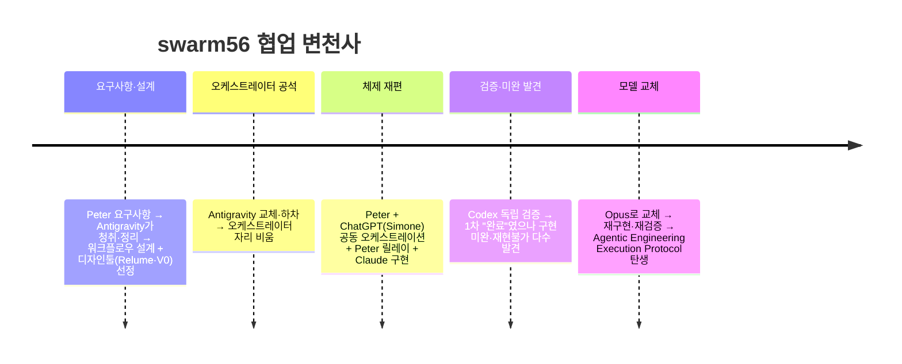
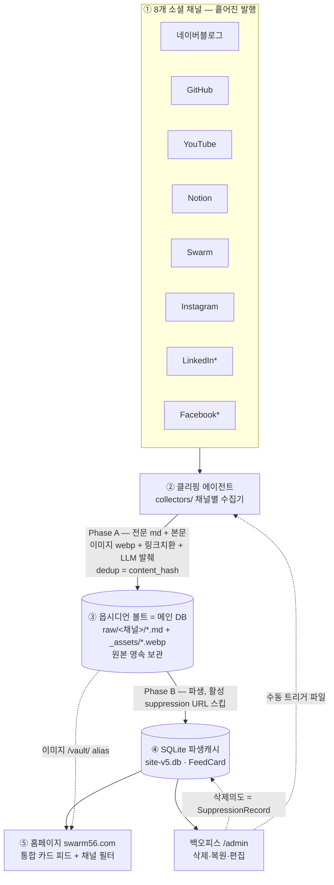
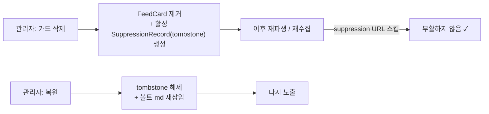
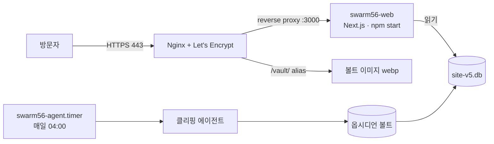

# swarm56 — 프로젝트 개요 (Project Overview)

> 최종 업데이트: 2026-06-29 (v5 라이브 기준) · 라이브: https://swarm56.com · 브랜치 `fix/r1-obsidian-single-source`
> **핵심 주제: 이종 멀티에이전트(hetero-multi-agent) 협업 워크플로우** — swarm56.com은 그 워크플로우로 만든 산출물(케이스 스터디).
> 관련: `INTEGRATED_PLAN_v5.md`, `CHANNEL_INTEGRATION_NOTES.md`, `VERIFICATION_CHECKLIST.md`

---

## 1. 프로젝트 개요

### 목적 — 흩어진 활동을 모으는 퍼스널 소셜미디어 허브

원종석은 네이버블로그·GitHub·YouTube·Notion·Instagram·Swarm 등 **여러 채널**에 글·코드·영상·메모를 흩어 발행한다. **swarm56.com의 1차 목적은 이 흩어진 활동을 한 곳에 자동으로 모아, 방문자가 "원종석이 무엇을 생각하고 무엇을 하는가" — 그의 철학과 활동 흐름을 한눈에 보게 하는 퍼스널 소셜미디어 허브**다. 채널마다 쪼개진 정체성을 **하나의 큐레이션된 피드**로 통합한다.

### 두 층위

1. **산출물 (Product)** — 위 목적을 구현한 `swarm56.com`. **8개 채널 → 자동 수집 → 통합 카드 피드.**
2. **핵심 주제 (Process / 연구)** — 그것을 **만드는 과정 자체**. 서로 다른 종류의 AI 에이전트·도구를 역할별로 협업시키는 **이종 멀티에이전트 워크플로우(hetero-multi-agent workflow)** 의 확립·사례화. **Peter의 평소 멀티에이전트 연구 주제와 직접 맞닿아 있다**(논문/책 자료화).

> 산출물의 목적은 **"흩어진 나를 한 곳에 모으는 허브"**, 그 과정의 핵심은 **"이종 에이전트들이 협업해 만든 방법"**. 요구사항 정리부터 디자인·구현·**검증까지 전 과정**을 에이전트들이 릴레이로 수행했다.

---

## 2. ★ Hetero-Multi-Agent Workflow (핵심)

단일 AI에 전부 맡기지 않고, **이종(異種)의 AI 에이전트·도구**를 *오케스트레이션 / 디자인 / 구현 / 검증* 역할로 나눠 협업시킨다. 강점이 다른 모델·도구를 조합하고, 역할 간 **견제·검증**으로 신뢰성을 확보한다.

### 2.1 협업 변천사 (실제 진행)

1. **요구사항·초기 설계** — Peter 요구사항을 **Antigravity**(Google Gemini 에이전트)가 청취·정리 → 워크플로우 설계 + **디자인 에이전트(Relume·V0 by Vercel) 선정**. (초기 오케스트레이터/아키텍트)
2. **오케스트레이터 공석** — 협업 중 Antigravity가 교체되어 하차.
3. **체제 재편** — 이전 프로젝트처럼 **Peter + ChatGPT(=Simone)** 가 오케스트레이션을 맡고, **Peter가 에이전트 간 릴레이**, **Claude가 구현**.
4. **1차 검증 → 미완 발견** — 화면엔 카드가 떠 "완료" 보고됐지만, **Codex 독립 검증**에서 구현 미완·재현불가·배포 미연결 다수 발견(Prisma P3005, `/vault` Nginx 누락, systemd 트리거 부재, lint 미실행, 세션 secret fallback 등). *"보이는 완료 ≠ 실제 완료."*
5. **Opus로 모델 교체 → 재구현·재검증** — 구현 모델을 Opus로 올려 미완분 수정·재검증(현재). 이 경험이 **Agentic Engineering Execution Protocol**(구현·동결·검증·수정·재검증 운영 절차)을 낳음.

→ **요구사항·디자인·구현·검증 전 과정이 멀티에이전트 협업.** 핵심 교훈:
> **에이전트 말 = 가설 · commit = 검증대상 · 실행로그 = 증거 · 독립검증 = 판정 · Owner = 최종승인.** 좋은 구현 = Functional · Conformance · Reproducibility · Operational 4기준 충족. (상세: Notion *"'완료했습니다'를 믿지 않게 된 날"*) — Peter의 연구 **Context-Preserving Multi-Assistant Collaboration Layer**(맥락 + 책임·증거의 연속성)와 직결.

**검증 자체도 멀티에이전트다** — **Claude**가 검증 기준(`VERIFICATION_CHECKLIST.md`) 작성 → **Codex**가 그에 의거해 **2·3차 독립 검증**(라운드별 commit SHA 고정, 증거 기반 PASS/FAIL, delta 재검증) → **ChatGPT(Simone)가 Peter의 자문역**(체크리스트 검토·진단 확인). 즉 구현뿐 아니라 **검증 절차 자체가 역할 분담된 멀티에이전트** 과정.

### 2.2 역할별 참여 에이전트
| 에이전트 / 도구 | 종류 | 역할 | 단계/시기 |
|---|---|---|---|
| **Antigravity** | Google Gemini 에이전트 | 초기 오케스트레이터·아키텍트: 요구사항 정리, 워크플로우 설계, 디자인툴(Relume·V0) 선정 | 초기 (이후 교체) |
| **Peter (원종석)** | 인간 | 오케스트레이터(공동)·결정권자·**릴레이** | 전 단계 |
| **ChatGPT (Simone)** | OpenAI GPT | 공동 오케스트레이터 + **Peter 자문역**(설계·체크리스트 검토) | 오케스트레이션·자문 |
| **Relume** | 디자인 AI | 사이트 구조·와이어프레임·컴포넌트 라이브러리 | 디자인 |
| **V0 by Vercel** | 디자인 AI | UI 컴포넌트 생성(React/Tailwind 코드) | 디자인 |
| **Claude (투투/OpenClaw)** | 코딩 AI | 구현·통합·문서화 + **검증 체크리스트 작성** | 구현·검증 |
| **Codex** | 검증 AI | 체크리스트 의거 **2·3차 독립 검증**(증거 기반 PASS/FAIL) | 검증 |
| **Hermes (헤라)** | 코딩 AI(별도 Claude) | 연구 보조 | 보조 |

> "이종(hetero)" = 서로 다른 벤더·종류의 AI(Antigravity·Relume·V0·Claude·Codex·GPT)를 한 워크플로우에 조합.

### 2.3 설계 철학 — Boris Cherny "Loop Engineering"
이 워크플로우·시스템은 **Boris Cherny의 Loop Engineering 철학**을 설계 단계에서 반영했다. 그래서 **단계별 상태저장 + 지속 검증**을 계속한다.
- **상태 영속성** — 각 단계 출력을 외부에 기록, **체크포인트**로 중단 후 재개. (예: 옵시디언 볼트=메인 DB이자 상태 저장소, 단계별 산출물 파일화)
- **단계별 검증** — 다음 단계 진입 전 현재 단계 검증(Codex 독립 검증 게이트, 검증 체크리스트).
- **탈출/재시도 규칙** — 최대 재시도·중단 조건 명시.
- **멱등성·재개 가능** — 클리퍼는 언제 재실행해도 안전.
- **단방향 데이터 흐름** + 부작용(side effect) 격리.

### 2.4 거버넌스 (신뢰성 장치)
`CLAUDE.md` 헌법: **승인 추론 금지** · **계획≠실행** · **행위자 명시** · **실행증거 없는 완료보고 금지** · **메모리 무결성** · 구현(Claude)/검증(Codex) 분리(자가검증 불인정).

### 2.5 협업 통신
Slack `#all-agent-collab`(핸드오프 실험) · Notion Journal(업무일지·위반사례) · 검증 산출물(`VERIFICATION_CHECKLIST.md`).

---

## 3. 요구사항

### 3.1 목적·배경 (왜 만드나)
- **통합(Hub)** — 8개 채널에 흩어진 글·활동을 한 곳에 모아 보여준다.
- **정체성** — 방문자가 원종석의 **철학·관심사·활동 흐름**을 한눈에 파악하게 한다.
- **최신성** — 새 글이 손 안 대고 **자동(일 1회)** 반영된다.
- **소유·통제** — 원본은 내 옵시디언 볼트에 **영속 보관**, 노출 여부는 내가 **통제**(삭제/복원/편집)한다.

### 3.2 기능
- 채널별 **카드 피드 + 채널 필터**, 카드 → **원문 링크**(본문 이미지 포함).
- 백오피스(`/admin`): 로그인, 카드 **삭제/복원/편집**, 수집 이력(SyncRun), **"지금 클리핑"/"강제 갱신"** 수동 트리거, 감사 로그.
- **삭제 의도 영속**(재수집해도 부활 안 함), **일 1회 자동 수집**.

### 3.3 비기능
단방향 데이터 흐름 · 멱등성·재개 가능 · 홈피/백오피스는 **볼트 읽기전용** · 비밀은 **env로만** · 개인 규모(1GB VPS) 운영.

---

## 4. 기술 스펙

| 영역 | 스택 |
|---|---|
| 홈피/백오피스 | Next.js 16, React 19, TypeScript, Tailwind v4 |
| ORM/DB | Prisma 6.19, SQLite |
| 클리핑 에이전트 | Python 3.12 (requests, beautifulsoup4, markdownify, Pillow) |
| 발췌 | LLM 다중 provider → truncation fallback |
| 볼트 / 동기화 | 옵시디언(Markdown+이미지) / CouchDB livesync(`sync.swarm56.com`) |
| 디자인 | Relume(구조/와이어프레임), V0 by Vercel(UI 컴포넌트) |
| 배포 | AWS Lightsail(Ubuntu), systemd, Nginx, Let's Encrypt |

---

## 5. 아키텍처 — 채널에서 허브까지의 데이터 흐름

이 프로젝트의 심장은 **"8개 채널에 흩어진 글이 어떻게 자동으로 홈페이지의 통합 피드가 되는가"** 다. 흐름은 **단방향**이며, 각 단계가 파일/DB에 상태를 남겨(상태 영속성) 언제든 **재개**할 수 있다.

### 5.1 전체 데이터 흐름 (수집 → 허브)

> `*` LinkedIn·Facebook은 현재 **빈 채널**(공식 API 제약, UI 플레이스홀더).

- **Phase A (클립)** — 채널 → 볼트 md(전문) + 본문 이미지(webp 재인코딩·SSRF 차단) + 링크 치환 + LLM 발췌. 중복은 `content_hash`로 제거.
- **Phase B (파생)** — 볼트 md → SQLite `FeedCard`. **활성 suppression URL은 스킵**(삭제 의도 보존). 홈피/백오피스는 이 캐시를 **읽기 전용**으로 소비.

### 5.2 삭제 영속성 — "방식 B" (tombstone)

삭제 키 = `originalUrl`. 모든 변경은 **원자적 트랜잭션** — 재실행해도 안전(멱등).

### 5.3 배포 토폴로지

Lightsail `54.116.19.34`(Ubuntu) · 앱 `/opt/swarm56/app` · 볼트 `/var/lib/swarm56/vault-v5` · DB `/var/lib/swarm56/web/site-v5.db`.

---

## 6. 모듈별 역할

**클리핑 에이전트(`agent/`)**: `main.py`(Phase A/B 오케스트레이터, FORCE) · `collectors/`(채널별) · `vault.py`·`db.py`(볼트 입출력·dedup / 파생·suppression·SyncRun) · `images.py`·`excerpt.py`(본문이미지 webp·SSRF / LLM 발췌·truncation) · `settings.py`(env).
**홈피/백오피스(`personal-brand-hub/`)**: `app/page.tsx`·`app/admin/` · `components/`(hero·about·header·footer·feed-card) · `lib/admin-repo.ts`(삭제B·복원·편집·트리거·감사) · `lib/auth.ts`(bcrypt·세션·rate limit) · `lib/feed-repository.ts`·`lib/md-frontmatter.ts` · `prisma/schema.prisma`.

---

## 7. 채널 현황

| 채널 | 상태 | 수집 |
|---|---|---|
| 네이버블로그·GitHub·YouTube·Notion·Swarm·Instagram | ✅ LIVE | RSS/API/스크래핑 |
| **LinkedIn · Facebook** | ⛔ 빈 채널 | 공식 API 제약 → UI 플레이스홀더(자동수집 안 함) |

---

## 8. 향후 로드맵

- **옵시디언 지식그래프 시각화** — 볼트 노드/링크를 홈피에 그래프뷰로 (직접구현 / Quartz / Obsidian Publish).
- **RAG** — 볼트 임베딩 → 의미검색·질의응답("내 글에게 물어보기").
- **미연동 채널** LinkedIn·Facebook → 백오피스 수동 등록 검토.
- **운영 보완** — 트리거 path-unit 설치, GitHub 릴리스 수집, 토큰 rotate, SSH 키 이동.

---

## 9. 운영 메모

- 서버: Lightsail `54.116.19.34`(Ubuntu). 앱 `/opt/swarm56/app`(npm start), DB `/var/lib/swarm56/web/site-v5.db`, 볼트 `/var/lib/swarm56/vault-v5`, 에이전트 `/opt/swarm56/agent`(+venv). systemd `swarm56-web`·`swarm56-agent.timer`.
- 배포: repo는 빌드본 복사로 운영 → 코드 변경은 서버 빌드+재시작 필요(푸시만으론 반영 X).
- 롤백: `app.old-*`·구 DB·백업 보존. 문구 수정: `personal-brand-hub/components/홈피_문구_수정가이드.md`.
