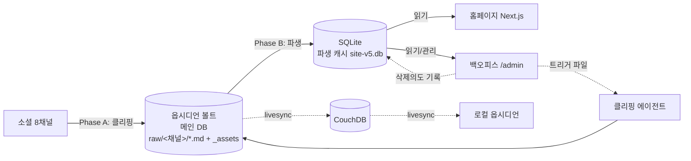
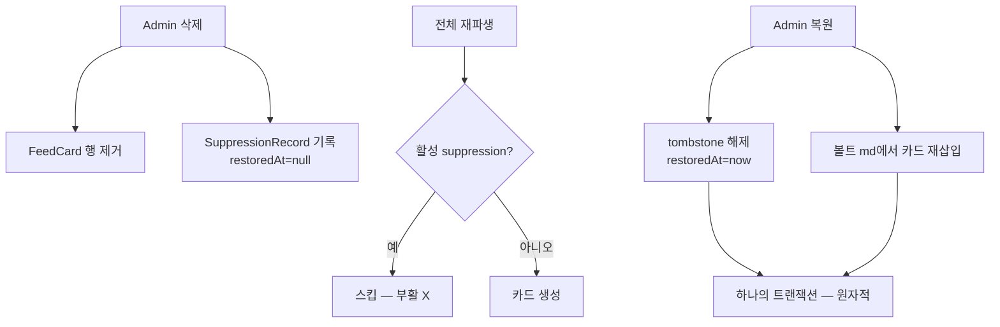
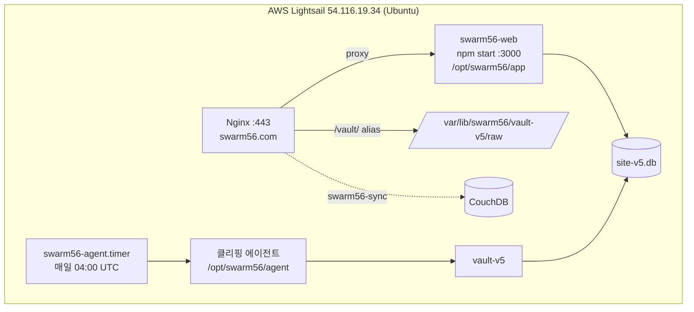
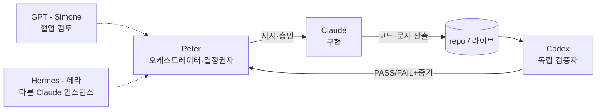

# swarm56 — 기술 개요 (Technical Overview)

> 최종 업데이트: 2026-06-29 (v5 라이브 배포 기준) · 작성: Claude (구현), 검증: Codex, 오케스트레이션: Peter
> 라이브: https://swarm56.com · 브랜치 `fix/r1-obsidian-single-source`
> 관련 문서: `INTEGRATED_PLAN_v5.md`(상세 설계), `CHANNEL_INTEGRATION_NOTES.md`, `VERIFICATION_CHECKLIST.md`

---

## 1. 프로젝트 개요

**swarm56 = 원종석(Jongseok Won)의 퍼스널 브랜드 허브.** 8개 소셜 채널에 흩어진 글·활동을 한 곳(swarm56.com)에 모아 보여주는 사이트.

**두 가지 목적:**
1. **표면 목적** — 채널별 콘텐츠 집계 홈페이지 + 어드민 백오피스.
2. **실제 연구 목적** — **이종(異種) 멀티에이전트 협업 워크플로우** 확립 및 사례 연구. (구현=Claude, 검증=Codex, 오케스트레이션=Peter 등 역할 분리 운영. 논문/책 자료화 대상.)

**핵심 설계 철학**: 옵시디언 볼트를 **단일 소스(메인 DB)** 로 두고, 소셜 → 클리핑 → 볼트 → 파생 캐시 → 홈피의 **단방향 데이터 흐름**.

---

## 2. 요구사항 (Requirements)

### 기능
- 8개 채널(네이버블로그·Notion·YouTube·GitHub·LinkedIn·Instagram·Facebook·Swarm) 콘텐츠를 카드 피드로 표시, 채널 필터.
- 각 카드 → 원문 링크(noopener). 본문 이미지 포함.
- 백오피스: 로그인(단일 관리자), 카드 삭제/복원/편집, 수집 로그(SyncRun), "지금 클리핑"/"강제 갱신" 트리거, 감사 로그.
- 삭제 의도 영속: 한번 삭제한 카드는 재수집/재파생에도 부활 X (의도 보존).
- 일 1회 자동 수집(데일리).

### 비기능
- **단방향 데이터 흐름** (볼트→SQLite→홈피, 역방향 쓰기 금지).
- **멱등성·재개 가능**(클리퍼 중단 후 재실행 안전).
- 홈피·백오피스는 볼트에 **쓰지 않음**(읽기 전용).
- 비밀(토큰·키)은 env로만, 코드/Git 금지.
- 개인 규모(저비용 1GB VPS) — 무거운 인프라 지양.

---

## 3. 기술 스펙 (Stack)

| 영역 | 스택 |
|---|---|
| 홈피/백오피스 | Next.js 16, React 19, TypeScript, Tailwind v4 |
| ORM/DB | Prisma 6.19, SQLite |
| 클리핑 에이전트 | Python 3.12 (requests, beautifulsoup4, markdownify, Pillow) |
| 발췌(요약) | LLM 다중 provider(OpenAI/Gemini/Anthropic) HTTP 호출 → 실패 시 truncation |
| 볼트 | 옵시디언(Markdown + 첨부 이미지) |
| 동기화(선택) | CouchDB (Obsidian livesync, `sync.swarm56.com`) |
| 배포 | AWS Lightsail VPS(Ubuntu), systemd, Nginx, Let's Encrypt |

---

## 4. 아키텍처

### 4.1 데이터 흐름 (단방향)

- **Phase A (클립)**: 채널 → 볼트 md(전문) + 본문 이미지(`_assets/*.webp`) + 링크 치환 + LLM 발췌. 볼트 md 존재 시 스킵(dedup, content_hash).
- **Phase B (파생)**: 볼트 md frontmatter → SQLite FeedCard. **활성 suppression URL은 스킵**(삭제 의도 보존).
- 홈피/백오피스는 SQLite만 읽음. 볼트 원본은 안 건드림.

### 4.2 삭제 영속성 — "방식 B" (Suppression / Tombstone)

삭제 키 = `originalUrl`(재파생에도 안정). 삭제/복원/편집 + 감사로그는 **한 트랜잭션**(원자성).

### 4.3 배포 토폴로지

- 앱은 `.env`를 **Next(@next/env)가 단독 로드** — systemd `EnvironmentFile` 사용 금지(이중 로드 시 bcrypt 해시 `$` 깨짐, 2026-06-29 핫픽스).

---

## 5. 워크플로우 + 역할별 참여 에이전트 (멀티에이전트)

| 에이전트 | 역할 | 비고 |
|---|---|---|
| **Peter (원종석)** | 오케스트레이터·결정권자 | 연구 방향·범위·우선순위·최종 승인. 모든 결정권 보유. |
| **Claude (투투/OpenClaw)** | 구현 | 코드/문서 작성. 검증·판정·임의 커밋·운영변경은 권한 밖(승인 후만). |
| **Codex** | 독립 검증자 | 구현자 주장 무시, 직접 실행·증거 기반 PASS/FAIL. 증거 없는 PASS 불인정. |
| GPT (Simone) | 협업 검토 | 설계·체크리스트 리뷰. |
| Hermes (헤라) | 별도 Claude 인스턴스 | 연구 보조. |

**거버넌스(CLAUDE.md 헌법)**: 승인 추론 금지, 계획≠실행(문서에 있다고 착수 아님), 행위자 명시, 실행 증거 없는 완료보고 금지, 메모리 무결성. (Appendix: HF-001 사건.)

**협업 통신**: Slack `#all-agent-collab`(실험), Notion Journal(업무일지·위반사례). 검증 산출물 = `VERIFICATION_CHECKLIST.md` 등.

---

## 6. 모듈별 역할

### 6.1 클리핑 에이전트 (`agent/`, Python)
| 모듈 | 역할 |
|---|---|
| `main.py` | 오케스트레이터. Phase A(채널→볼트), Phase B(볼트→SQLite). `SWARM56_FORCE=1`=강제 재클립. |
| `settings.py` | env 기반 설정(경로·채널ID·토큰·LLM키·이미지 상한). |
| `collectors/` | 채널별 수집: `naver_blog`·`github`·`youtube`·`notion`·`swarm`·`instagram`·`facebook`. |
| `vault.py` | 볼트 md 쓰기(frontmatter)·읽기(`iter_vault`)·dedup(`existing_hash`). |
| `images.py` | 본문 이미지 → `_assets/*.webp`(SSRF 차단·MIME·크기·Pillow 재인코딩·디스크 서킷브레이커). 링크 상대경로 치환. |
| `excerpt.py` | 발췌: LLM 다중 provider 순차 → 전부 실패/키없음 시 truncation. 클립 때 1회. |
| `db.py` | 볼트 frontmatter → FeedCard 파생(`upsert_from_frontmatter`), suppression 스킵(`is_suppressed`), SyncRun 로그. |
| `thumbnail.py` / `models.py` | 썸네일 다운로드 / 정규화 레코드 타입. |

볼트 frontmatter 키: `title·channel·source·url·published·synced_at·content_hash·external_id·excerpt·thumbnail`.

### 6.2 홈피/백오피스 (`personal-brand-hub/`, Next.js)
| 모듈 | 역할 |
|---|---|
| `app/page.tsx` | 홈페이지(hero + Social Hub 카드 피드). SQLite 읽기. |
| `app/admin/` | 백오피스: `page.tsx`(가드+UI), `login/`, `actions.ts`(서버액션). |
| `components/` | `hero-section`·`about-section`·`site-header`·`site-footer`·`feed-card` 등 (고정 문구는 여기). |
| `lib/feed-repository.ts` | 홈피용 카드 조회(SQLite 읽기전용). |
| `lib/admin-repo.ts` | 삭제(방식B)·복원·편집·트리거파일·감사로그(트랜잭션). |
| `lib/auth.ts` | bcrypt 비번 검증 + HMAC 세션쿠키(HttpOnly/Secure/SameSite/12h) + 로그인 rate limit. |
| `lib/md-frontmatter.ts` | 볼트 md frontmatter 파싱(복원용, 읽기전용, traversal 차단). |
| `prisma/schema.prisma` | FeedCard·SuppressionRecord·AdminAudit·SyncRun. |

### 6.3 배포 (`deploy/`)
systemd 유닛(`swarm56-web`·`swarm56-agent.timer`·트리거 path/service), Nginx conf(`swarm56-web` + `/vault` alias), 빌드/롤백 스크립트.

---

## 7. 채널 현황

| 채널 | 상태 | 수집 방식 |
|---|---|---|
| 네이버 블로그 | ✅ 라이브 | RSS + 본문 스크래핑 |
| GitHub | ✅ 라이브 | 공개 레포(+릴리스 예정) |
| YouTube | ✅ 라이브 | 채널 RSS(무인증) |
| Notion | ✅ 라이브 | Integration 토큰 + DB 페이지 본문(blocks) |
| Swarm | ✅ 라이브 | Foursquare OAuth |
| Instagram | ✅ 라이브 | Graph API(장기토큰 자동 갱신) |
| **LinkedIn** | ⛔ 빈 채널 | 공식 API 제약 심함 → UI 플레이스홀더만. 수동 시도 기록(`CHANNEL_INTEGRATION_NOTES.md`) |
| **Facebook** | ⛔ 빈 채널 | 동일(앱 검수·페이지 권한 장벽). 자동 수집 안 함 |

원칙: "남에게 공개로 보이는 것만 전문 클립."

---

## 8. 향후 로드맵 (To-Do)

### 8.1 옵시디언 지식그래프 시각화 (홈피)
- 볼트의 노트·링크 관계를 **홈피에 그래프 뷰**로 시각화 (Obsidian Graph view를 웹으로).
- 옵션: (a) swarm56.com에 직접 구현(D3/그래프 라이브러리), (b) Quartz/Digital Garden 정적사이트 임베드, (c) Obsidian Publish(유료).
- 볼트가 이미 서버에 있으므로(`vault-v5`) 거기서 노드/엣지 추출 → 시각화.

### 8.2 RAG (검색·질의)
- 볼트 콘텐츠 임베딩 → 의미 검색 / 질의응답.
- 홈피에 "내 글에게 물어보기" 류 인터페이스.

### 8.3 미연동 채널
- **LinkedIn·Facebook**: 자동 수집이 막히면 → 백오피스 **수동 등록** 경로 검토.

### 8.4 운영 보완
- 백오피스 "지금 클리핑/강제 갱신" → **systemd 트리거 path-unit 설치**(현재 미설치).
- GitHub **릴리스** 수집 추가.
- 노출 토큰 **rotate**, SSH 키 repo 밖 보관, CouchDB(sync) 정리/활용 결정.

---

## 9. 운영 메모

- 서버: AWS Lightsail `54.116.19.34`(Ubuntu, Seoul). 앱 `/opt/swarm56/app`(`npm start`), DB `/var/lib/swarm56/web/site-v5.db`, 볼트 `/var/lib/swarm56/vault-v5`, 에이전트 `/opt/swarm56/agent`(+venv). systemd `swarm56-web`·`swarm56-agent.timer`. Nginx + `/vault/` alias.
- 배포: repo는 git이 아닌 **빌드본 복사**로 운영(`/opt/swarm56/app`) → 문구/코드 변경은 **서버 빌드+재시작** 필요(푸시만으로 라이브 반영 안 됨).
- 롤백: 배포 시 `app.old-*`/`agent.old-*`/구 DB/백업 보존.
- 문구 수정: `personal-brand-hub/components/홈피_문구_수정가이드.md` 참고.
