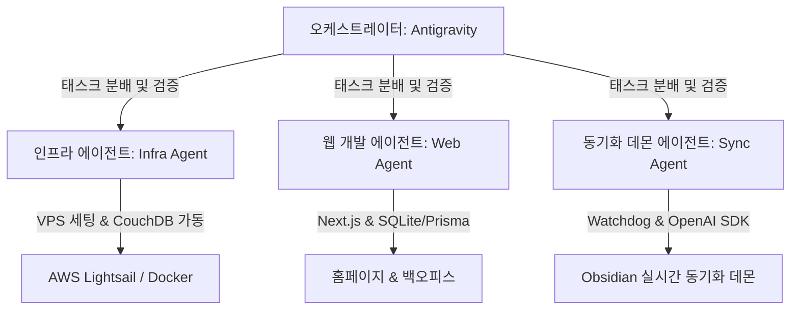
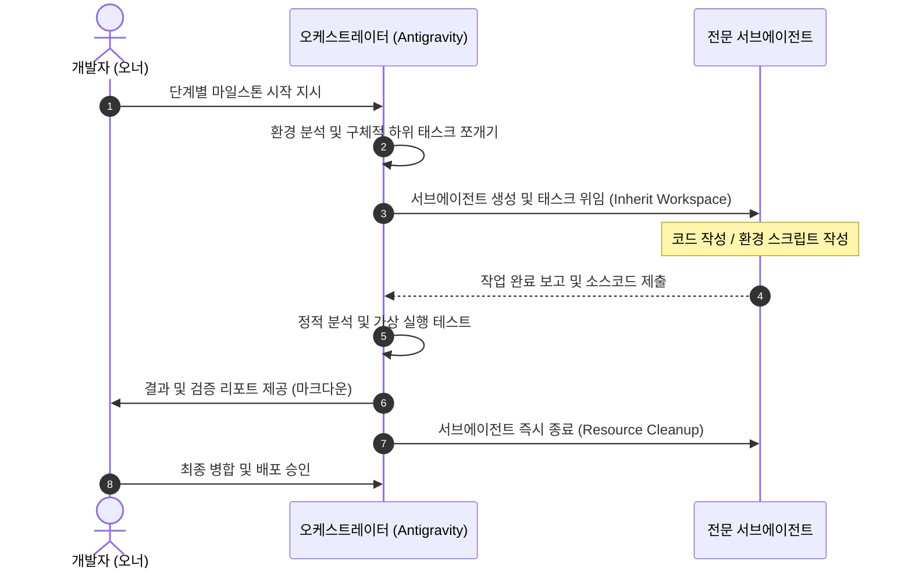

# 개인 활동 허브 (Personal Brand Hub) 구축 프로젝트
## 에이전트 협업 워크플로우 및 통합 개발 기획서 (Agent Orchestration & Dev Brief)

본 문서는 오케스트레이터 에이전트(Antigravity)의 지휘 하에 각 전문 분야의 서브에이전트들이 협업하여 개인 활동 허브 및 옵시디언 동기화 인프라를 구축하기 위한 마스터 기획서입니다. 개발자와 에이전트 Swarm이 한눈에 워크플로우와 할 일을 파악할 수 있도록 구성되었습니다.

---

## 1. 에이전트 협업 아키텍처 및 역할 정의 (Roles & Swarm Architecture)

본 프로젝트는 오케스트레이터(Orchestrator)가 전체 일정을 조율하고, 3개의 전문화된 서브에이전트(Sub-agents)에게 독립적인 태스크를 분배 및 검증하는 구조로 실행됩니다.



### 1.1 에이전트별 역할 및 책임
1. **오케스트레이터 (Orchestrator - Antigravity)**
   - **역할**: 프로젝트 총괄 지휘 및 검증.
   - **태스크**: 기획서 관리, 서브에이전트 생명주기 관리(종료 및 회수), 코드 품질 리뷰(PR 검증), 단위 및 통합 테스트 수행.
2. **인프라 개발 에이전트 (Infra Agent)**
   - **역할**: VPS 서버 환경 튜닝 및 옵시디언 동기화 서버 구축.
   - **태스크**: Ubuntu OS 메모리 최적화(Swap), Docker 환경 구성, CouchDB 데이터 볼륨 매핑, Nginx 역방향 프록시 및 SSL 인증서 연동.
3. **웹 개발 에이전트 (Web Agent)**
   - **역할**: Next.js 기반 반응형 웹 애플리케이션 및 백오피스 어드민 구축.
   - **태스크**: SQLite Prisma 스키마 연동, 피드 카드 3열 그리드 마크업 이식(v0.dev 기반), 어드민 로그인 및 LLM API Key 관리 기능 구현.
4. **동기화 데몬 에이전트 (Sync Agent - Python)**
   - **역할**: 옵시디언 마크다운 문서를 실시간 파싱하고 요약하여 DB에 반영하는 백그라운드 프로세스 개발.
   - **태스크**: Watchdog 기반 파일 이벤트 감시, Frontmatter 메타데이터 파싱, 공식 OpenAI API 비동기 연동, SQLite 다이렉트 데이터 적재 스크립트 작성.

---

## 2. 에이전트 지휘 워크플로우 (Orchestration Flow)

오케스트레이터는 각 단계마다 **분배 -> 수행 -> 코드 리뷰 및 테스트 -> 승인/병합**의 루프를 거쳐 자원을 안전하게 회수합니다.



---

## 3. 단계별 마일스톤 및 할 일 목록 (Phase-by-Phase Backlog)

### Phase 1. VPS 인프라 구축 및 메모리 최적화 (Infra Agent 담당)
- [x] **가상 메모리 스왑 튜닝**: AWS Lightsail (Ubuntu 24.04 1GB RAM)의 OOM 방지를 위한 4GB Swap 파일 설정 스크립트(`setup_swap.sh`) 작성.
- [x] **Nginx Reverse Proxy 구성**: Let's Encrypt SSL을 적용하고 포트 5984를 외부 도메인(`sync.yourdomain.com`)으로 역방향 라우팅하기 위한 Nginx 설정 파일 작성.
- [x] **배포 패키지 구성**: 설정 파일들을 프로젝트 루트의 `deploy/` 디렉토리에 빌드.

### Phase 2. 옵시디언 실시간 동기화 서버 구축 (Infra Agent 담당)
- [ ] **CouchDB Docker compose 구성**: CouchDB 3.3.3 컨테이너 가동 설정 및 데이터 영구 보존용 볼륨 바인딩 명세 작성.
- [ ] **통합 동기화 검증**: 모바일/데스크톱 Obsidian LiveSync 플러그인과 VPS CouchDB 간의 동기화 정상 동작 상태 검증.

### Phase 3. Next.js 홈페이지 & SQLite/Prisma 기본 설계 (Web Agent 담당)
- [ ] **Next.js 프로젝트 초기화**: App Router 기반 Next.js 14 프로젝트 생성 및 구조 정립.
- [ ] **Prisma SQLite 연동**: 피드(`Post`), LLM API Key 보관(`Config`), 동기화 로그(`SyncLog`) 모델이 포함된 `schema.prisma` 작성.
- [ ] **백오피스 서버 액션**: `/admin` 경로 구축 및 안전한 API Key 암호화/저장 로직(`updateApiKey`) 구현.

### Phase 4. UI/UX 디자인 컴포넌트 이식 및 바인딩 (Web Agent 담당)
- [ ] **반응형 피드 그리드 구축**: 1120px 컨테이너 가이드를 적용하여 모바일 1열, 태블릿 2열, 데스크톱 3열 반응형 레이아웃 구현.
- [ ] **호버 마이크로 애니메이션**: 피드 카드 마우스 오버 시 `hover:shadow-md transition-shadow` 인터랙션 추가.
- [ ] **Prisma 데이터 바인딩**: SQLite 데이터베이스로부터 최신 피드 리스트를 서버 컴포넌트에서 안전하게 Fetch하여 카드 레이아웃에 렌더링.

### Phase 5. VPS 동기화 에이전트 개발 및 검증 (Sync Agent 담당)
- [ ] **옵시디언 Watchdog 스크립트**: 마크다운 파일 수정 감지 시 프론트매터(`publish: true`, `status != synced`) 상태를 필터링하는 파이썬 감시 데몬 작성.
- [ ] **공식 OpenAI API 연동**: `gpt-4o-mini` 모델을 사용하여 요약본(150자 내외)과 카테고리 태그 1~3개를 JSON 포맷으로 추출하는 로직 구현.
- [ ] **통합 연동 테스트**: 모바일 작성 -> CouchDB 동기화 -> Python Watcher 요약 -> DB 저장 -> 홈페이지 실시간 반영 검증.

---

## 4. 핵심 기술 연동 규격 및 디렉토리 구조 (System Architecture Specs)

### 4.1 통합 디렉토리 구조 (Directory Structure)
```
/homepage_project
├── /deploy                     # VPS 배포 관련 설정 파일
│   ├── docker-compose.yml      # CouchDB 설정
│   ├── nginx.conf              # SSL & 역방향 프록시 설정
│   └── setup_swap.sh           # 4GB 가상 메모리 스왑 스크립트
├── /web                        # Next.js 프론트엔드/백엔드 웹앱
│   ├── /prisma
│   │   └── schema.prisma       # SQLite 스키마
│   ├── /app
│   │   ├── globals.css         # CSS 토큰 및 전역 스타일
│   │   ├── /admin
│   │   │   └── actions.ts      # API Key 등록 서버액션
│   │   └── page.tsx            # 피드 리스트 홈화면
├── /agent                      # VPS 백그라운드 동기화 데몬
│   ├── config.json             # DB 및 옵시디언 금고 경로
│   ├── requirements.txt
│   └── publish_daemon.py       # Watchdog 감시 및 LLM 요약 데몬
```

### 4.2 SQLite 데이터베이스 명세 (SQLite Schema)
```prisma
// datasource 및 generator 설정 생략

model Post {
  id             String   @id @default(uuid())
  title          String
  summary        String   // LLM 요약 (최대 300자)
  originalUrl    String   @unique
  sourcePlatform String   // naver_blog, github, notion, linkedin 등
  tags           String   // JSON Array String
  publishedAt    DateTime
  status         String   @default("ACTIVE") // ACTIVE, INACTIVE
  createdAt      DateTime @default(now())
  updatedAt      DateTime @updatedAt
}

model Config {
  id        String   @id @default(uuid())
  key       String   @unique // 예: 'openai_api_key', 'anthropic_api_key'
  value     String   // 암호화된 API Key
  updatedAt DateTime @updatedAt
}

model SyncLog {
  id        String   @id @default(uuid())
  status    String   // SUCCESS, ERROR
  message   String   // 동기화 로그 메시지
  syncTime  DateTime @default(now())
}
```

---

## 5. 보리스 처니(Boris Cherny) 루프 기반의 상태 복구 및 체크포인팅 설계 (State Resiliency)

에이전트가 예기치 않게 종료되거나 서버 리스타트 등의 오류가 발생했을 때, 토큰과 시간의 낭비를 원천적으로 차단하기 위해 **실행 상태(State)의 저장 및 체크포인팅**을 작업 원칙으로 적용합니다.

### 5.1 파일 시스템 기반 상태 저장 (State Persistence)
- **태스크 상태 관리 (`task.md`)**: 최상위 수준의 태스크 매니저로 작동하며, 단계별 상태(`[ ]`, `[/]`, `[x]`)를 항시 파일로 기록합니다. 오케스트레이터 및 서브에이전트는 구동되거나 재개될 때 반드시 이 체크포인트 파일부터 리딩합니다.
- **중간 산출물 즉시 파일화**: 서브에이전트가 작성한 모든 스크립트, 설정 파일, 소스코드는 빌드 과정 중 메모리에 가두지 않고 즉시 로컬 파일시스템에 물리적 파일로 안전하게 기록(커밋)하여 다음 노드(에이전트)가 즉각 인계받을 수 있도록 합니다.

### 5.2 장애 복구 및 Resilient Loop (Error Recovery)
- **체크포인트 복원 (Resume from Checkpoint)**: 작업 중 오류나 중단이 발생할 시, 처음 단계부터 다시 실행(재요청)하지 않고, 마지막으로 기록된 로컬 마일스톤 및 중간 마크다운 산출물에서 상태를 읽어 재개합니다.
- **중간 단계 문서화 (Intermediate Documentation)**: 각 서브에이전트 태스크 종료 시 `walkthrough.md`에 진행된 기술 사항 및 미결 사항을 정교하게 기록하여, 복구 지점(Recovery Point)의 메타데이터를 유지합니다.

### 5.3 실행의 멱등성 보장 (Idempotence)
- **부작용 방지**: 모든 환경 구성 스크립트(예: Swap 메모리 생성 스크립트) 및 DB 적재 로직은 **멱등성(Idempotency)**을 갖도록 작성합니다. 이미 설정되었거나 이미 적재된 데이터가 존재할 경우 에러를 내지 않고 우회 처리하여 다중 실행 시 발생할 수 있는 중복 생성을 원천 차단합니다.

### 5.4 에러의 데이터화 및 자가 치유 (Errors as Values & Self-Healing)
- **에러 핸들링**: 시스템 예외가 발생하여 전체 동기화 데몬 루프가 완전히 죽지 않도록 모든 에러를 명시적인 데이터 상태(Value)로 래핑하여 `SyncLog` 테이블에 기록합니다.
- **지연 및 백오프 재시도 (Exponential Backoff)**: LLM API 호출 등 외부 네트워크 연동 시 일시적인 장애(Rate Limit 등)를 극복하기 위해 지수 백오프 기반의 자가 치유 재시도 로직을 탑재합니다.

---

## 6. 검증 계획 및 테스트 케이스 (Verification Plan)

### 6.1 인프라 튜닝 단계 검증
- **스왑 작동 검증**: 스왑 활성화 후 `free -h` 및 `swapon --show`를 통해 가상 메모리 4GB 잡혔는지 확인.
- **CouchDB 통신 검증**: Nginx 리버스 프록시 연동 후 `https://sync.yourdomain.com` 접속 시 CouchDB 기본 JSON 응답 확인.

### 6.2 웹앱 및 데이터 동기화 단계 검증
- **어드민 연동 검증**: 백오피스에서 API Key를 입력했을 때 SQLite `Config` 테이블에 암호화 적재되는지 검증.
- **실시간 요약 동기화 검증**:
  1. 옵시디언 금고에 `publish: true` 속성을 가진 마크다운 작성 및 저장.
  2. `publish_daemon.py` 로그에 감시 로그 확인 및 OpenAI `gpt-4o-mini` API 정상 호출 확인.
  3. `Post` 테이블에 요약본과 태그가 정상 저장되었는지 SQLite DB 쿼리.
  4. 웹앱 브라우저 새로고침 시 메인 피드 카드 그리드에 해당 글이 3열 반응형 카드로 예쁘게 노출되는지 검증.

